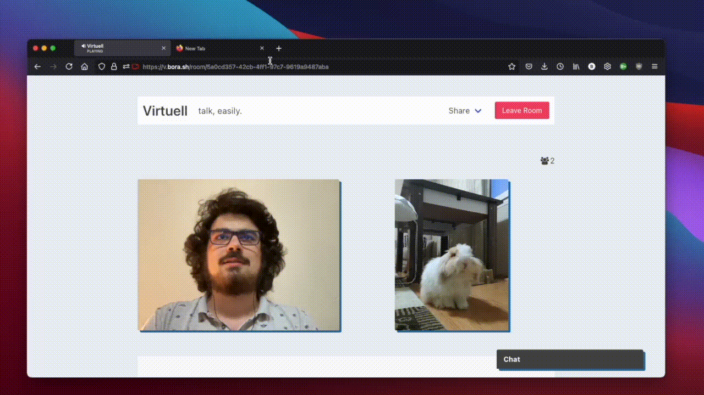

# Quik.do

	
	

		talk, easily.
	

## What

Quik.do is a video conferencing tool.  
We want to be able to talk in the simplest way. That's why we created **Quik.do**.

## Features

**Accountless**  
You don't need to create any account to use Quik.do, Just use it!

**No installation**  
You don't need to install anything. Simply use it in your browser, in any device.

**No money charge**  
Free, forever.

**Share as stream**  
You will be able share your video meeting to the world as stream.

**Self hosted**  
If you wish, you can run this application as self-hosted for your own domain.

## Preview

## Behind

Quik.do works on Pion ecosystem. Used technologies are below;

- Pion/WebRTC
- Pion/Turn
- Fiber
- FastHTTP Websocket
