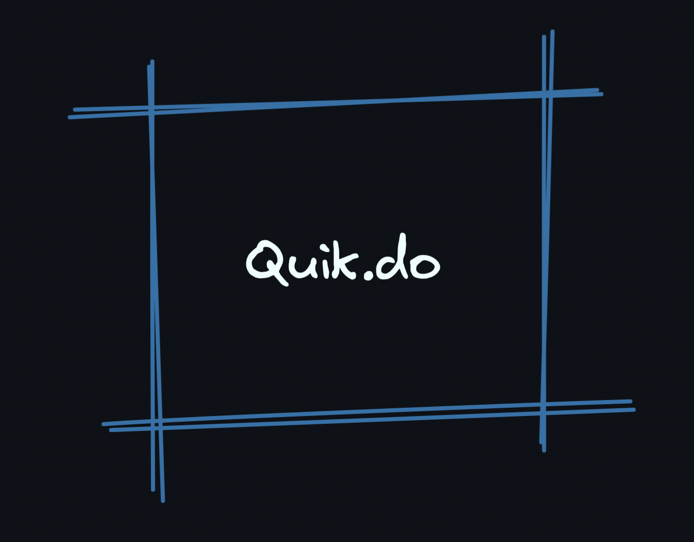

# Virtuell

<div align="center">
	
	<p>
		<strong><code>Virtuell - v0.1.0</code></strong> <br>
		talk, easily. <br>
	</p>
</div>

<hr>

**Note:**  
This project is heavily under development.  
IT IS NOT PRODUCTION READY YET.  
DO NOT USE IT.

## What

Virtuell is a video conference tool.

## Why

We want to be able to talk in the simplest way. That's why we created Virtuell.

**Accountless**  
You don't need to create any account to use Virtuell. Just use it!

**No need for program**  
You don't need to install anything to your device. Simply use it in your browser, in any device.

**No money charge**  
Free, forever.

**Share as stream**  
You will be able share your video meeting as stream to the world.

## Preview


## Behind

Virtuell works on Pion ecosystem. Used technologies are below;

- Pion/WebRTC
- Pion/Turn
- Fiber
- FastHTTP Websocket

## Development

Build images;  
```sh
make build-dev
```

For development;  
```sh
make run-dev
```

For production;  
```sh
make run-prod
```
